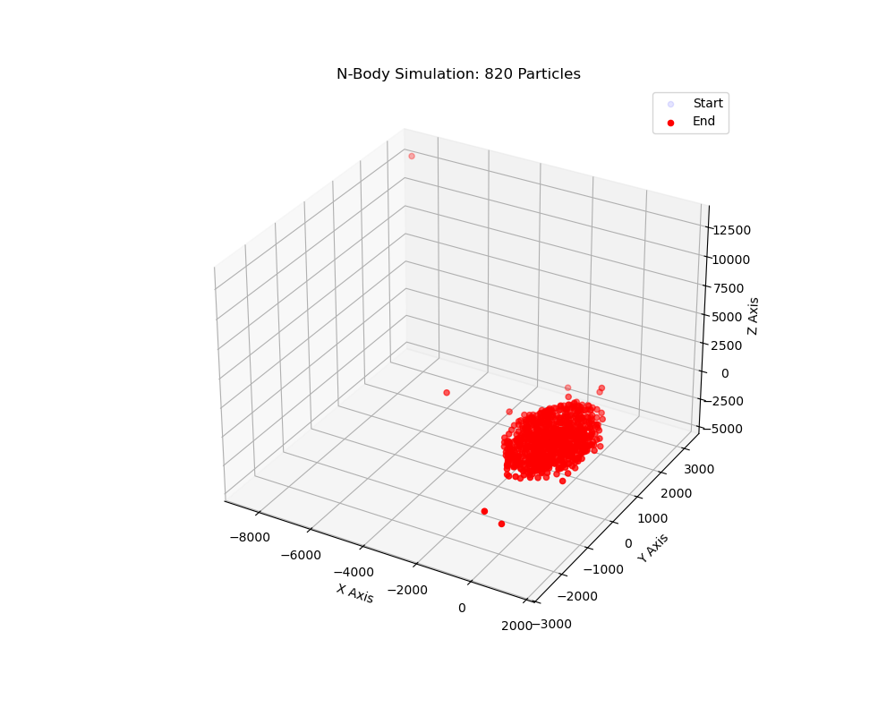

# CUDA N-Body Simulation Capstone

## Project Overview
This project implements a gravitational N-Body simulation using CUDA C++. The goal is to simulate the interaction of thousands of particles in 3D space, where every particle exerts a gravitational force on every other particle ($O(N^2)$ complexity).

## Key Features & Optimizations
1.  **CUDA Kernel:** Custom kernel to handle particle integration.
2.  **Shared Memory Tiling:** The naive approach requires $N$ reads from global memory for every thread. This implementation uses **Tiling** to load blocks of body data into high-speed **Shared Memory**, reducing global memory bandwidth pressure and significantly increasing throughput.
3.  **Visualization:** Includes a Python script to verify particle movement.

## Hardware Requirements
* NVIDIA GPU (Compute Capability 6.0+)
* CUDA Toolkit (11.0 or higher)
* Python 3 (for visualization) with `matplotlib` and `pandas`

## How to Build and Run
This project includes a Makefile and an automation script.

1.  **Compile and Run:**
    ```bash
    chmod +x run.sh
    ./run.sh
    ```

2.  **Manual Compilation:**
    ```bash
    make all
    ./bin/nbody_sim 4096
    ```

## Performance Analysis
The implementation uses a tile size of 256 (`BLOCK_SIZE`). By pre-loading body data into shared memory, we reduce the latency of memory accesses during the inner force-calculation loop. 

## Visualization
After running the simulation, the program outputs `nbody_output.csv`. The python script `scripts/visualize.py` reads this file and produces `simulation_result.png`, showing the dispersion of particles over time.


## Simulation Results
Below is a visualization of the N-Body simulation (8192 particles). The red cluster demonstrates the gravitational collapse calculated by the GPU.
